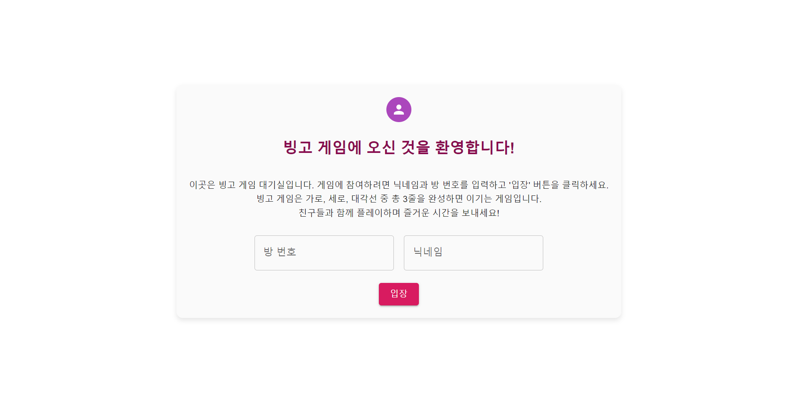
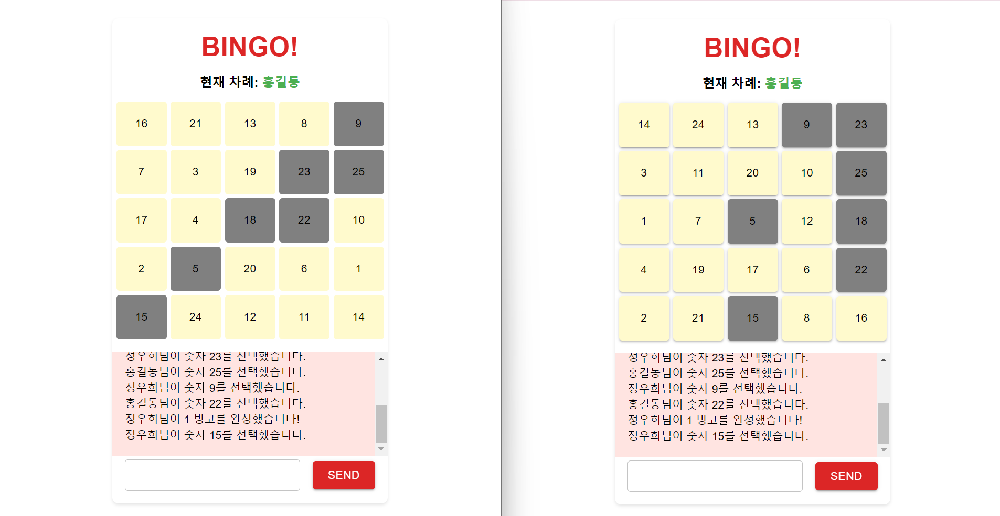

# 🎉 Bingo Game Project 🎉

 

 

## 🌟 프로젝트 개요

### 🎯 목표

2021년에 C++로 구현했던 2인 플레이 한계를 개선하여, REACT와 NODEJS를 사용하여 다수의 플레이어가 참여할 수 있는 웹 애플리케이션 빙고 게임을 개발했습니다. 
이 게임은 실시간 소켓 통신을 통해 운영되며, 플레이어들이 방에 입장해 채팅하고 게임을 진행하면서 선택한 빙고 숫자가 모든 플레이어에게 실시간으로 반영됩니다.

### 🛠️ 기술 스택

- **프론트엔드**: React, Material-UI
- **백엔드**: Node.js, Express
- **실시간 통신**: Socket.IO

 

## 🚀 주요 기능

1. **🚪 방 생성 및 입장**: 플레이어는 닉네임과 방 번호를 입력하여 게임 방을 생성하거나 기존 방에 입장할 수 있습니다.
2. **💬 실시간 채팅**: 방 안의 모든 플레이어가 실시간으로 채팅할 수 있습니다.
3. **🕹️ 게임 시작 및 준비 상태 관리**: 모든 플레이어가 준비되면 게임이 시작됩니다.
4. **👆🏻 빙고 숫자 선택**: 각 플레이어는 자신의 차례에 숫자를 선택할 수 있습니다. 선택한 숫자는 모든 플레이어 빙고판에 반영됩니다.
5. **⏰ 빙고 완료 알림**: 플레이어가 빙고를 완성하면 다른 플레이어에게 알림이 전송됩니다.
6. **🔚 게임 종료 및 리셋**: 게임이 종료되면 상태가 초기화됩니다.

 

## 📸 스크린샷

### 🌐 메인 화면

### 🌦️ 상세 날씨 정보 모달

 

## 🛠️ 개발 과정

1. **프로젝트 초기 설정**: Node.js와 Express로 서버를 설정하고, React로 프론트엔드 환경을 구축했습니다.
2. **Socket.IO 통합**: Socket.IO를 사용하여 서버와 클라이언트 간의 실시간 통신을 구현했습니다.
3. **UI 디자인**: Material-UI를 사용하여 사용자 인터페이스를 디자인하고 스타일링했습니다.
4. **게임 로직 구현**: 빙고 게임의 핵심 로직을 작성하고, 각 방의 상태를 관리하기 위한 구조를 설계했습니다.
5. **테스트 및 디버깅**: 기능을 테스트하고, 발생하는 버그를 수정했습니다.

 

## ⚠️ 어려웠던 부분과 해결 과정

1. **API 호출 및 데이터 처리**
    - 실시간 통신은 처음에는 Socket.IO를 사용하는 것이 낯설었습니다. 하지만 관련 문서를 찾아보고 간단한 예제들을 따라해 보며 점차 이해하게 되었습니다. 특히, Socket.IO의 이벤트 기반 아키텍처를 이해하는 것이 중요했습니다. 클라이언트와 서버 간의 양방향 통신을 설정하고 데이터를 주고받는 과정에서 여러 문제가 발생했지만, 문서와 커뮤니티의 도움을 받아 이를 극복할 수 있었습니다.

2. **게임 로직 구현**
    - 빙고 게임의 로직은 예상보다 복잡했습니다. 특히, 빙고 보드에서 세로, 가로, 대각선으로 일정한 패턴을 찾아내는 알고리즘을 개발하는 데 어려움을 겪었습니다. 이를 해결하기 위해 먼저 각 줄에 해당하는 인덱스를 미리 정의하고, 플레이어가 숫자를 선택할 때마다 해당하는 줄의 인덱스를 체크하여 빙고가 완성되었는지를 판별하는 방식을 선택했습니다. 이러한 접근 방식을 통해 게임 로직을 더욱 명확하게 이해하고 구현할 수 있었습니다.

3. **상태 관리**
    - React에서 상태 관리는 프로젝트의 규모가 커질수록 중요해졌습니다. 특히, 다양한 컴포넌트 간에 상태를 공유하고 업데이트하는 것이 복잡성을 높였습니다. 이를 해결하기 위해 Context API와 함께 useContext 훅을 사용하여 상태를 전역적으로 관리하고, 필요한 컴포넌트에서 이를 활용하여 갱신하는 방식을 선택했습니다. 이를 통해 상태 관리를 보다 효율적으로 처리할 수 있었습니다.
